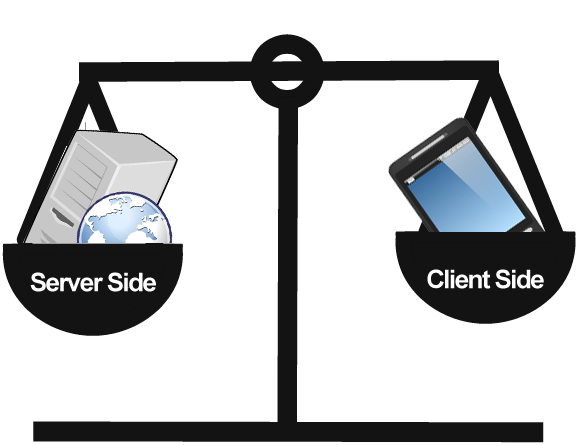

# Server-Side Development for Front-end React Weather-App

# The Objective of this part of the project was to achieve the following:

  - To develop a web API for Assignment 1.
  - Technologies: Node, Express, MongoDB, Mongoose, Testing tools (Mocha, Chai etc.).
  - Integrate the API with the React app.
  - Can extend API beyond scope of client app:

# Setup Installation Instructions as follows
  • Ensure that you have the following steps completed before running the Project: 
   
        <b> git clone this repo</b>
   
        <b> sudo npm install </b>
       
        <b> sudo npm start </b>
          

[Client-Side React Appliciation](https://github.com/robertsolomon97/WebAppAssignment-1)

  Should you have any problems, don't hesitate to contact me on my email at:  [20079462@mail.wit.ie](mailto:20079462@mail.wit.ie)
 or if you find a bug  [open up an issue here](https://github.com/robertsolomon97/WebApp-ServerSide/issues)
